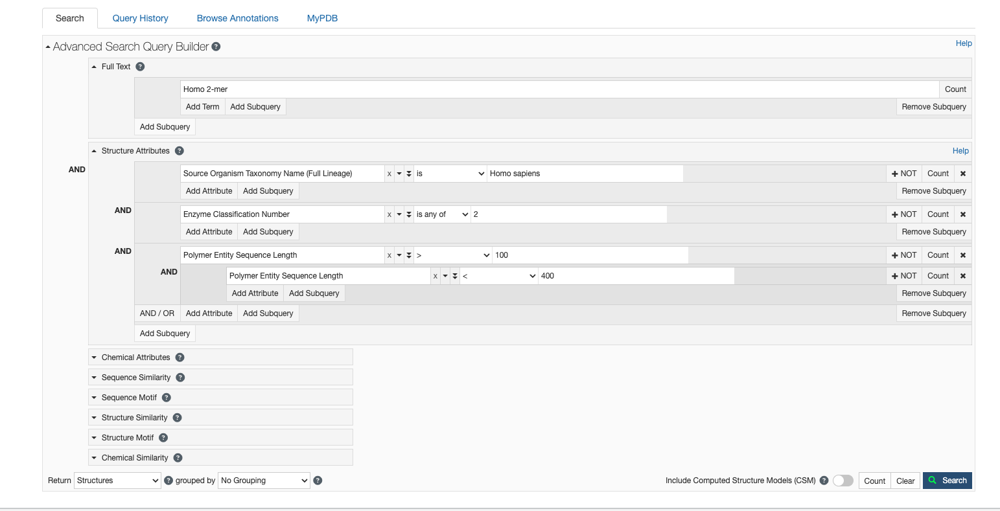

I used this query for finding the protein and I found `1ZUO`

# Find the principle article of the paper. What is the function of the protein as you understand from the paper. What is the main emphasis of the paper?

A human ubiquitin conjugating enzyme (E2)-HECT E3 ligase structure-function screen.
Sheng, Y., Hong, J.H., Doherty, R., Srikumar, T., Shloush, J., Avvakumov, G.V., Walker, J.R., Xue, S., Neculai, D., Wan, J.W., Kim, S.K., Arrowsmith, C.H., Raught, B., Dhe-Paganon, S.
(2012) Mol Cell Proteomics 11: 329-341

PubMed: 22496338 Search on PubMedSearch on PubMed Central
DOI: https://doi.org/10.1074/mcp.O111.013706
Primary Citation of Related Structures:  
1Y6L, 1YH2, 1YRV, 1ZDN, 1ZUO, 2A4D, 2A7L, 2AWF, 2F4W, 2OB4, 2QGX, 2Z5D, 3BZH, 3CEG

PubMed Abstract: 
Here we describe a systematic structure-function analysis of the human ubiquitin (Ub) E2 conjugating proteins, consisting of the determination of 15 new high-resolution three-dimensional structures of E2 catalytic domains, and autoubiquitylation assays for 26 Ub-loading E2s screened against a panel of nine different HECT (homologous to E6-AP carboxyl terminus) E3 ligase domains. Integration of our structural and biochemical data revealed several E2 surface properties associated with Ub chain building activity; (1) net positive or neutral E2 charge, (2) an "acidic trough" located near the catalytic Cys, surrounded by an extensive basic region, and (3) similarity to the previously described HECT binding signature in UBE2L3 (UbcH7). Mass spectrometry was used to characterize the autoubiquitylation products of a number of functional E2-HECT pairs, and demonstrated that HECT domains from different subfamilies catalyze the formation of very different types of Ub chains, largely independent of the E2 in the reaction. Our data set represents the first comprehensive analysis of E2-HECT E3 interactions, and thus provides a framework for better understanding the molecular mechanisms of ubiquitylation.

Organizational Affiliation: 
Department of Biology, York University, 4700 Keele Street, Toronto, ON M3J 1P3, Canada.

## Main emphasis and my understanding
The paper aims to connect the structural properties of human E2 enzymes to their functional behavior with HECT E3 ligases, producing the first comprehensive map of E2–HECT interactions and showing how E3s, not E2s, dictate ubiquitin chain type.

# What is the EC number of your enzyme, what does it tell you?
EC number:  2.3.2.19.  
The enzyme belongs to the class of “ligases” that form carbon-nitrogen bonds (EC 2), specifically those that catalyse ubiquitin conjugation (EC 2.3.2 = ubiquitin-protein ligases). So it tells you the enzyme’s functional class and reaction type.
# How many helices and strand exist in the PDB file?
6 helices (α1-α6) and 4 strands (β1-β4)
# Which year was the structure deposited?
2005

